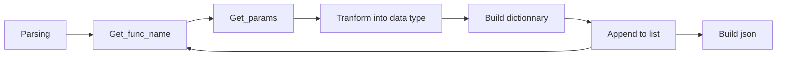

*This project has been created as part of the 42 curriculum by eel-kerc.*


## <font color="#89CFF0">Description</font>
Call Me Maybe is a `LLM` oriented project.   
The main goal is to guide llm into the right tokens to make a valid json output.  
For that, the program should use the given llm sdk and reads the `logits` token by token and apply `constrained decoding` to choose tokens that satisfy json format.   
The program should be able to read from any json valid and returns valid json containing the functions names, parameters and the prompt link to that choice.

## <font color=#B2BEB5>Instructions</font>

**To run the program, install the dependencies first with the following command**

```bash
make install
```

**And then run it with or in the debug mode with these two commands**

```bash
make run
```
```bash
make debug
```

**For type checking, strict type checking and cleaning here is the followings commands**

```bash
make lint
```
```bash
make lint-strict
```
```bash
make clean
```

```bash
make fclean
```

## <font color=#C4A484>Algorithm explanation</font>

The program runs as a prompt pipeline. It first get every prompts and function's definitions and then iterate on every prompt with the following pipeline. On the end, the program build the json with every values that the llm has returned on a valid format.




## <font color=#AFE1AF>Design decisions</font>

*The following prompts format has been chosen to get the values from the LLM.*

### Functions names's prompt

```python
"""
<|im_start|>system
{"name":"fn_add_numbers","description":"Add two numbers together and return their sum."}
{"name":"fn_greet","description":"Generate a greeting message for a person by name."}
{"name":"fn_reverse_string","description":"Reverse a string and return the reversed result."}
{"name":"fn_get_square_root","description":"Calculate the square root of a number."}
{"name":"fn_substitute_string_with_regex","description":"Replace all occurrences matching a regex pattern in a string."}
{"name":"fn_null","description":""}
IMPORTANT : Choose fn_null if no description correspond
<|im_end|>
<im_start>user
Substitute the word 'cat' with 'dog' in 'The cat sat on the mat with another cat'
<im_end>
<im_start>assistant
{"name":
"""
```

The function names's prompt is made of the prompt, function names and descriptions. The sentence ```IMPORTANT : Choose fn_null if no description correspond``` has been added to make the llm choose the backup function if nothing correspond.   
This prompt is the mix of a prompt with enough context to have result that are precise enough and short enough (only the names and description) to keep a pretty fast generation.   
The last part with assitant is what make the llm thinking more precise because it already thinks that it is in a json format, and increase the probability of the next token to be in the context that we desire.

### Parameters's prompt

```python
"""
<im_start>system
{'name': 'fn_add_numbers', 'description': 'Add two numbers together and return their sum.', 'parameters': {'a': {'type': 'number'}, 'b': {'type': 'number'}}, 'returns': {'type': 'number'}}
<im_end>
<im_start>user
What is the sum of 2 and 3?
 <im_end>
<im_start>assistant
{"parameters": {"a": 
"""
```

The parameters's prompts contains the functions that had been chosen by the llm as well as the prompt.  
The llm is given in the same context but now as generating the parameters of the functions. Contrained Decoding is apply to the token choosen to make the result valid into the type of the parameters. At each generation, the result of the parameters founded is add to the prompt for the next parameters's generation of that prompt.

## <font color=#DE3163>Performance analysis</font>

Perfomance depends on the total number of functions and their sizes because it affect the lenght of the prompt given to the llm. Here is a visual of how is it affect:

### Function's name

| Nb of functions (same size) | Time (seconds) |
|---						  |---			   |
|5	  					      |52.7			   |
|10						      |64.8			   |
|20							  |111.3		   |

### Function's parameters

| Size of functions | Time (seconds)   |
|---			    |---			   |
|Default			|55.1			   |
|Default x2			|71.1			   |

Performance can be increased by withdrawing functions descriptions or still have still small optimisations but the given prompt has been choose to keep a minimum of precision and consistency.
Batching and catching can also be made to improved generation but catching is catching is not possible in this project, as well as batching is not the main objective of this project.

## <font color=#F3E5AB>Challenges faced</font>

*Here is a list of the differents challenges in this project that made it difficult :*

- Keeping generation's time low
- Having perfect valid json format
- Strict json parsing
- Managing LLM thinking and "intelligence"
- Constrained Decoding depending of parameters's types

Generation reliability and performance has been resolved be optimising prompt.  
Json format has been solved by not letting the llm managing the format but the program.  
A type getter has been implemented to determine which constrained decoding to use.

## <font color=#C3B1E1>Testing strategy</font>

Program was first testing on the defaults test to assure project directions.  
Every new implementation was tested first on the basic tests.  
After all that, complex tests has been made to verify project adaptibility and edges cases.  
Both parsings and generations were tested.

## <font color=#0BDA51>Example usage</font>

This program can be used to associate data from list of fuction, and filtering data that are not linked to any of the given function.  
The user should determine what prompt to use and put them into a json format. Then the user should determine what function to build and then run the program. He will have a list a results that he can reads more easily.  
This data can then be reattribute into other program with corresponding function and data that are in the null function can be ignored because not in the context.

## <font color=#967969>Resources</font>

- [Qwen's documentation](https://qwen.readthedocs.io/en/latest/getting_started/concepts.html)  
- [Json formating](https://www.json.org/json-fr.html)  
- [Mermaid visual](https://mermaid.ai/open-source/intro/getting-started.html)
- [Markdown Guide](https://www.markdownguide.org/extended-syntax/)
- [Color Picker](https://htmlcolorcodes.com/)

### AI Usage

**AI has been used to :**

- Understand terms of the project (logits, llm, tokens)  
- Performance optimisation
- Mypy debugging